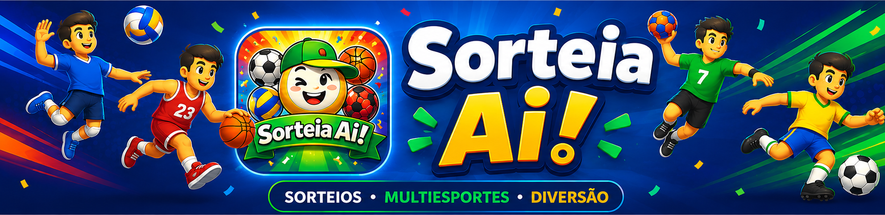

<div align="center">
  
  <br><br>
  
  
  
  
</div>

<br>

**Sorteia Aí!** é um app de sorteio inteligente de times para grupos de esporte. Sem cadastro, sem servidor — funciona 100% offline após a primeira abertura. Cadastre seus jogadores, configure a formação e o app monta os times mais equilibrados possíveis, respeitando posições, nível técnico e gênero.

Disponível como **PWA** (instala direto pelo browser) e em breve na **Google Play Store**.

---

## 📱 Screenshots

<div align="center">
  
  
  
  
</div>

<br>

<div align="center">
  <sub><b>Tela inicial</b> · <b>Jogadores (Vôlei)</b> · <b>Jogadores (Futebol)</b> · <b>Jogadores (Handebol)</b></sub>
</div>

---

## ⚽ Esportes suportados

| Esporte | Formações disponíveis (Premium) |
|---|---|
| 🏐 **Vôlei** | 5x1, 6x2, 4x2, Livre, Areia 2x2, Quarteto 4x4 |
| ⚽ **Futebol** | Society 7x7, Futsal 5x5, Campo 11x11, Pelada Livre |
| 🏀 **Basquete** | 5x5 Oficial, 3x3 Olímpico, Livre |
| 🤾 **Handebol** | 7x7 Oficial, Formações Livres |

---

## ✨ Funcionalidades

### Versão Gratuita (todos os usuários)
- ✅ Cadastro ilimitado de jogadores
- ✅ Nota técnica por estrelas (1–5)
- ✅ Posição principal e secundária
- ✅ Filtro por gênero
- ✅ Sorteio aleatório básico (2 times)
- ✅ Funciona offline (PWA)
- ✅ Dark mode automático

### Premium por esporte — R$ 9,90 · compra única
- 🔒 Formações específicas com posições obrigatórias
- 🔒 Modos: Pelada, Treino, Campeonato, Misto (% feminino)
- 🔒 Equilíbrio avançado — 500 tentativas, menor desvio de skill
- 🔒 Refazer sorteio mantendo a mesma configuração
- 🔒 Arrastar jogador entre times — segura e arrasta para trocar
- 🔒 Cadeado por jogador — trava até 2 por time; ficam fixos no Refazer
- 🔒 Sugestão automática de troca para equilibrar os times
- 🔒 Sem anúncios neste esporte

---

## 📊 Índice de confiança do sorteio

Após cada sorteio o app exibe um índice baseado em:
- Diferença de skill total entre os times
- Cumprimento das posições obrigatórias da formação
- Equilíbrio de tamanho dos times

| Faixa | Resultado |
|---|---|
| 90–100% | Excelente |
| 80–89% | Bom |
| 70–79% | Regular |
| < 70% | Aceitável |

---

## 📲 Como instalar

### Android — PWA (já disponível)
1. Abra o **Chrome** no Android
2. Acesse **[adrianpz.github.io/appsorteio-cpz](https://adrianpz.github.io/appsorteio-cpz)**
3. Menu (⋮) → **"Adicionar à tela inicial"**
4. O ícone aparece na home e o app abre em tela cheia

### Android — Play Store (em breve)
- Versão nativa com IAP real e fullscreen sem barra de endereço

### iOS — PWA via Safari (já disponível)
1. Abra o **Safari** no iPhone/iPad
2. Acesse **[adrianpz.github.io/appsorteio-cpz](https://adrianpz.github.io/appsorteio-cpz)**
3. Toque em **Compartilhar** (⬆) → **"Adicionar à Tela de Início"**

> **Nota:** No iOS o app é sempre gratuito. As compras premium estão disponíveis apenas no Android (Play Store).

---

## 🛠 Stack técnica

| Tecnologia | Uso |
|---|---|
| HTML / CSS / JS puro | App completo sem frameworks ou build |
| PWA (manifest + service worker) | Instalação e modo offline |
| LocalStorage | Jogadores, seleção e status de compra |
| Bubblewrap CLI | Geração do APK / AAB para Play Store |
| TWA (Trusted Web Activity) | Shell Android que carrega o PWA em fullscreen |
| jimp | Processamento de ícones edge-to-edge |
| Playwright | Screenshots automáticos para Play Store |

---

## 📁 Estrutura

```
appsorteio-cpz/
├── index.html            # Tela inicial — escolha do esporte
├── volei.html            # Sorteador de vôlei
├── futebol.html          # Sorteador de futebol
├── basquete.html         # Sorteador de basquete
├── handebol.html         # Sorteador de handebol
├── premium.js            # Lógica free/premium, cadeado, drag-to-swap
├── sw.js                 # Service worker (cache offline)
├── manifest.json         # PWA manifest
├── privacy.html          # Política de privacidade
│
├── icon-192.png          # Ícone PWA (192×192, edge-to-edge)
├── icon-512.png          # Ícone Play Store (512×512, edge-to-edge)
├── favicon-48.png        # Favicon
├── banner-home.png       # Banner da tela inicial
├── feature-graphic.png   # Feature graphic Play Store (1024×500)
│
├── screenshot-home.png
├── screenshot-volei.png
├── screenshot-futebol.png
├── screenshot-basquete.png
├── screenshot-handebol.png
│
├── .well-known/
│   └── assetlinks.json   # Digital Asset Links para o TWA
│
├── generate-icons.js     # Gera ícones edge-to-edge com jimp
└── take-screenshots.js   # Screenshots automáticos com Playwright
```

---

## 🔨 Build (desenvolvedores)

O projeto Android fica em `../appsorteio-twa/`.

**Pré-requisitos:** Android Studio instalado.

```bash
# APK para sideload / teste
cd appsorteio-twa
JAVA_HOME="/c/Program Files/Android/Android Studio/jbr"
./gradlew assembleRelease
# → app/build/outputs/apk/release/app-release.apk

# AAB para Play Store
./gradlew bundleRelease
# → app/build/outputs/bundle/release/app-release.aab

# Regenerar ícones
cd appsorteio-cpz && node generate-icons.js

# Regenerar screenshots
node take-screenshots.js
```

---

## 🗺 Roadmap

- [x] PWA completo com 4 esportes
- [x] Sistema free/premium por esporte
- [x] Cadeado e drag-to-swap de jogadores
- [x] APK / AAB gerado e assinado
- [x] Assets da Play Store prontos
- [ ] Publicar na Google Play Store
- [ ] Integrar Google Play Billing (IAP real)
- [ ] Integrar AdMob (banner nativo no TWA)
- [ ] Detecção de plataforma iOS → mensagem "disponível no Android"

---

## 📄 Privacidade

O app não coleta dados pessoais. Tudo fica no dispositivo via `localStorage`. Nenhuma informação é enviada para servidores.

→ [Política de privacidade completa](privacy.html)

---

<div align="center">
  <br>
  <sub>Desenvolvido por CPZ Digital · <a href="mailto:adriano.cpaz16@gmail.com">adriano.cpaz16@gmail.com</a></sub>
</div>
